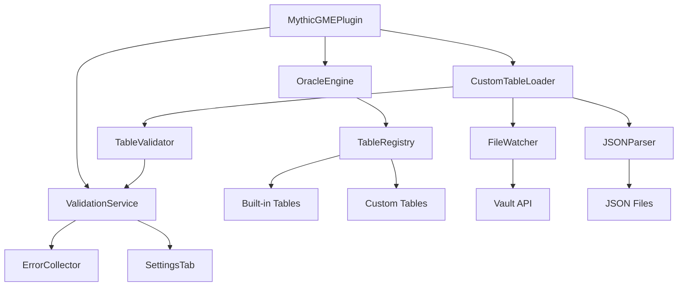

# Design Document

## Overview

The Custom Table Import feature extends the Mythic GME plugin to support user-defined oracle tables loaded from JSON files. The design introduces a file-watching system that monitors a designated folder in the vault, validates JSON table definitions, and integrates valid tables into the existing table registry. The architecture maintains separation between built-in and custom tables while presenting a unified interface to users.

Key design principles:
- Non-intrusive: Custom tables integrate seamlessly without modifying existing code
- Resilient: Validation errors don't break the plugin or prevent other tables from loading
- Performant: File watching uses Obsidian's native APIs to minimize overhead
- User-friendly: Clear error messages and example files help users succeed

## Architecture

### High-Level Component Structure



### Component Responsibilities

**CustomTableLoader**
- Manages the lifecycle of custom table loading
- Coordinates file watching, parsing, and validation
- Maintains a map of file paths to loaded tables
- Handles add/modify/delete events for table files

**FileWatcher**
- Monitors the "mythic-gme-tables" folder using Obsidian's Vault API
- Detects file creation, modification, and deletion events
- Filters for .json files only
- Recursively watches subdirectories

**JSONParser**
- Reads JSON files from the vault
- Parses JSON content into JavaScript objects
- Handles both single table objects and arrays of tables
- Catches and reports JSON syntax errors

**TableValidator**
- Validates table structure against the OracleTable interface
- Checks for required fields and correct types
- Validates range coverage and overlap
- Validates diceType values against enum
- Returns detailed validation errors

**ValidationService**
- Collects validation errors from all sources
- Provides API for querying errors by file or table
- Exposes errors to the settings tab UI
- Clears errors when files are fixed or removed

**ErrorCollector**
- Stores validation errors with context (file, table, field)
- Groups errors by severity (error, warning)
- Provides formatted error messages for display

## Components and Interfaces

### Custom Table Data Models

```typescript
// Extends existing OracleTable interface
interface CustomOracleTable extends OracleTable {
    source: 'custom';
    filePath: string;
    loadedAt: number;
}

// File watching
interface TableFile {
    path: string;
    tables: CustomOracleTable[];
    errors: ValidationError[];
    lastModified: number;
}

// Validation
interface ValidationError {
    file: string;
    tableId?: string;
    field?: string;
    message: string;
    severity: 'error' | 'warning';
}

interface ValidationResult {
    valid: boolean;
    errors: ValidationError[];
    table?: CustomOracleTable;
}

// Settings extension
interface MythicGMESettings {
    // ... existing settings
    customTablesFolder: string; // Default: "mythic-gme-tables"
    showCustomTables: boolean; // Default: true
    showBuiltInTables: boolean; // Default: true
    validationErrors: ValidationError[]; // Persisted for display
}
```

### CustomTableLoader Interface

```typescript
class CustomTableLoader {
    private plugin: MythicGMEPlugin;
    private fileWatcher: FileWatcher;
    private loadedFiles: Map<string, TableFile>;
    private validationService: ValidationService;
    
    constructor(plugin: MythicGMEPlugin);
    
    async initialize(): Promise<void>;
    async loadAllTables(): Promise<void>;
    async loadTableFile(path: string): Promise<TableFile>;
    async reloadAllTables(): Promise<void>;
    
    getCustomTables(): CustomOracleTable[];
    getValidationErrors(): ValidationError[];
    
    private handleFileCreated(path: string): Promise<void>;
    private handleFileModified(path: string): Promise<void>;
    private handleFileDeleted(path: string): Promise<void>;
    
    cleanup(): void;
}
```

### FileWatcher Interface

```typescript
class FileWatcher {
    private vault: Vault;
    private folderPath: string;
    private callbacks: FileWatcherCallbacks;
    private eventRef: EventRef;
    
    constructor(vault: Vault, folderPath: string, callbacks: FileWatcherCallbacks);
    
    start(): void;
    stop(): void;
    
    private onVaultChange(file: TAbstractFile): void;
    private isJsonFile(file: TAbstractFile): boolean;
    private isInWatchedFolder(file: TAbstractFile): boolean;
}

interface FileWatcherCallbacks {
    onCreate: (path: string) => Promise<void>;
    onModify: (path: string) => Promise<void>;
    onDelete: (path: string) => Promise<void>;
}
```

### TableValidator Interface

```typescript
class TableValidator {
    static validate(data: any, filePath: string): ValidationResult;
    
    private static validateStructure(data: any): ValidationError[];
    private static validateRequiredFields(table: any): ValidationError[];
    private static validateDiceType(table: any): ValidationError[];
    private static validateEntries(table: any): ValidationError[];
    private static validateRangeCoverage(table: any): ValidationError[];
    private static validateRangeOverlap(table: any): ValidationError[];
}
```

### ValidationService Interface

```typescript
class ValidationService {
    private errors: Map<string, ValidationError[]>;
    
    addErrors(file: string, errors: ValidationError[]): void;
    clearErrors(file: string): void;
    getErrorsForFile(file: string): ValidationError[];
    getAllErrors(): ValidationError[];
    hasErrors(): boolean;
    
    formatErrorsForDisplay(): string;
}
```

## Data Models

### JSON File Format

Users create JSON files with the following structure:

**Single Table:**
```json
{
    "id": "my-custom-oracle",
    "name": "My Custom Oracle",
    "category": "Custom/Subcategory",
    "type": "Standard",
    "diceType": "d100",
    "description": "Optional description",
    "entries": [
        { "range": [1, 10], "result": "First result" },
        { "range": [11, 20], "result": "Second result" },
        { "range": [21, 100], "result": "Third result" }
    ]
}
```

**Multiple Tables:**
```json
[
    {
        "id": "table-one",
        "name": "Table One",
        "category": "Custom",
        "type": "Standard",
        "diceType": "d20",
        "entries": [
            { "range": [1, 10], "result": "Result A" },
            { "range": [11, 20], "result": "Result B" }
        ]
    },
    {
        "id": "table-two",
        "name": "Table Two",
        "category": "Custom",
        "type": "Descriptor",
        "diceType": "d100",
        "entries": [
            { "range": [1, 50], "result": "Result X" },
            { "range": [51, 100], "result": "Result Y" }
        ]
    }
]
```

### Validation Rules

1. **Required Fields:**
   - id (string, unique across all tables)
   - name (string, non-empty)
   - category (string, non-empty)
   - type (string, must be: "Tool", "Variation", "Standard", or "Descriptor")
   - diceType (string, must be: "d100", "d20", "d10", "d6", or "custom")
   - entries (array, non-empty)

2. **Entry Validation:**
   - Each entry must have "range" (array of 2 numbers) and "result" (string)
   - range[0] must be <= range[1]
   - Ranges must not overlap
   - Ranges must cover the full dice range (e.g., 1-100 for d100)

3. **ID Uniqueness:**
   - Custom table IDs must not conflict with built-in table IDs
   - Custom table IDs must be unique across all custom tables
   - Validation error if duplicate ID detected

### Range Coverage Validation

```typescript
function validateRangeCoverage(entries: OracleTableEntry[], diceType: DiceType): ValidationError[] {
    const errors: ValidationError[] = [];
    const maxRoll = getMaxRollForDiceType(diceType);
    
    // Sort entries by range start
    const sorted = [...entries].sort((a, b) => a.range[0] - b.range[0]);
    
    // Check if starts at 1
    if (sorted[0].range[0] !== 1) {
        errors.push({
            message: `Range coverage must start at 1, but starts at ${sorted[0].range[0]}`,
            severity: 'error'
        });
    }
    
    // Check for gaps
    for (let i = 0; i < sorted.length - 1; i++) {
        const currentEnd = sorted[i].range[1];
        const nextStart = sorted[i + 1].range[0];
        
        if (nextStart !== currentEnd + 1) {
            errors.push({
                message: `Gap in range coverage: ${currentEnd} to ${nextStart}`,
                severity: 'error'
            });
        }
    }
    
    // Check if ends at max
    const lastEnd = sorted[sorted.length - 1].range[1];
    if (lastEnd !== maxRoll) {
        errors.push({
            message: `Range coverage must end at ${maxRoll}, but ends at ${lastEnd}`,
            severity: 'error'
        });
    }
    
    return errors;
}
```

## UI Design

### Settings Tab - Validation Errors Section

```
┌─────────────────────────────────────────┐
│ Custom Tables                           │
├─────────────────────────────────────────┤
│ Tables Folder: [mythic-gme-tables]      │
│                                         │
│ ☑ Show custom tables                   │
│ ☑ Show built-in tables                 │
│                                         │
│ [Reload Custom Tables]                  │
│ [Create Example Table]                  │
│                                         │
│ Loaded Tables: 12 custom, 8 built-in    │
│                                         │
│ ⚠ Validation Errors (2)                │
│ ┌─────────────────────────────────────┐ │
│ │ ❌ my-table.json                    │ │
│ │    • Missing required field: name   │ │
│ │    • Invalid diceType: d50          │ │
│ │                                     │ │
│ │ ❌ broken-table.json                │ │
│ │    • JSON syntax error: line 5      │ │
│ └─────────────────────────────────────┘ │
└─────────────────────────────────────────┘
```

### Oracle View - Custom Table Indicator

```
┌─────────────────────────────────────┐
│ ▼ Mythic Magazine                   │
│   • Issue 1 Oracle 📄        [🎲]  │
│   • Issue 2 Oracle 📄        [🎲]  │
│                                     │
│ ▼ Custom                            │
│   • My Homebrew Oracle 📄    [🎲]  │
└─────────────────────────────────────┘

Legend: 📄 = Custom table
```

### Commands

1. **Reload Custom Tables**
   - Command ID: `mythic-gme:reload-custom-tables`
   - Shows notice: "Reloaded X custom tables (Y errors)"

2. **Create Example Custom Table**
   - Command ID: `mythic-gme:create-example-table`
   - Creates folder if needed
   - Creates example-table.json
   - Creates README.md with documentation
   - Shows notice: "Example table created in mythic-gme-tables/"

3. **Open Custom Tables Folder**
   - Command ID: `mythic-gme:open-tables-folder`
   - Opens the tables folder in file explorer
   - Creates folder if it doesn't exist

## Error Handling

### Error Scenarios

1. **JSON Syntax Error**
   - Catch parse exception
   - Log error with file name and line number
   - Add to validation errors
   - Continue loading other files

2. **Missing Required Field**
   - Identify missing field
   - Log error with table ID (if available) or file name
   - Skip table, continue with others in same file

3. **Invalid Dice Type**
   - Log error with valid options
   - Skip table

4. **Range Overlap**
   - Identify overlapping entries
   - Log error with specific ranges
   - Skip table

5. **Range Gap**
   - Identify gap location
   - Log error with missing range
   - Skip table (or treat as warning?)

6. **Duplicate Table ID**
   - Check against built-in and existing custom tables
   - Log error identifying conflict
   - Skip table with duplicate ID

7. **File Read Error**
   - Catch file system errors
   - Log error with file path
   - Continue with other files

8. **Folder Doesn't Exist**
   - Create folder on first load
   - Log info message
   - Continue normally

### Error Recovery

```typescript
class ErrorHandler {
    static async handleFileLoadError(
        path: string,
        error: Error,
        validationService: ValidationService
    ): Promise<void> {
        const validationError: ValidationError = {
            file: path,
            message: `Failed to load file: ${error.message}`,
            severity: 'error'
        };
        
        validationService.addErrors(path, [validationError]);
        console.error(`Custom table load error [${path}]:`, error);
        
        new Notice(`Failed to load custom table: ${path}`);
    }
    
    static handleValidationErrors(
        path: string,
        errors: ValidationError[],
        validationService: ValidationService
    ): void {
        validationService.addErrors(path, errors);
        
        console.warn(`Validation errors in ${path}:`, errors);
        
        // Don't show notice for every file, just log
        // User can check settings tab for details
    }
}
```

## Integration with Existing Code

### OracleEngine Modifications

```typescript
class OracleEngine {
    private builtInTables: Map<string, OracleTable>;
    private customTables: Map<string, CustomOracleTable>;
    
    constructor(builtInTables: OracleTable[]) {
        this.builtInTables = new Map(
            builtInTables.map(t => [t.id, t])
        );
        this.customTables = new Map();
    }
    
    // New methods
    addCustomTable(table: CustomOracleTable): void {
        this.customTables.set(table.id, table);
        this.rebuildCategories();
    }
    
    removeCustomTable(tableId: string): void {
        this.customTables.delete(tableId);
        this.rebuildCategories();
    }
    
    clearCustomTables(): void {
        this.customTables.clear();
        this.rebuildCategories();
    }
    
    // Modified methods
    getTable(id: string): OracleTable | undefined {
        return this.builtInTables.get(id) || this.customTables.get(id);
    }
    
    getAllTables(): OracleTable[] {
        return [
            ...Array.from(this.builtInTables.values()),
            ...Array.from(this.customTables.values())
        ];
    }
    
    private rebuildCategories(): void {
        // Rebuild category structure including custom tables
        // Maintain separate tracking of custom vs built-in
    }
}
```

### Plugin Initialization

```typescript
class MythicGMEPlugin extends Plugin {
    private customTableLoader: CustomTableLoader;
    
    async onload() {
        await this.loadSettings();
        
        // Initialize engine with built-in tables
        this.engine = new OracleEngine(BUILT_IN_TABLES);
        
        // Initialize custom table loader
        this.customTableLoader = new CustomTableLoader(this);
        await this.customTableLoader.initialize();
        
        // Load custom tables
        const customTables = await this.customTableLoader.loadAllTables();
        customTables.forEach(table => this.engine.addCustomTable(table));
        
        // Register view, commands, etc.
        this.registerView(/* ... */);
        this.addCommands();
    }
    
    onunload() {
        this.customTableLoader.cleanup();
    }
    
    private addCommands() {
        this.addCommand({
            id: 'reload-custom-tables',
            name: 'Reload Custom Tables',
            callback: async () => {
                await this.reloadCustomTables();
            }
        });
        
        this.addCommand({
            id: 'create-example-table',
            name: 'Create Example Custom Table',
            callback: async () => {
                await this.createExampleTable();
            }
        });
        
        this.addCommand({
            id: 'open-tables-folder',
            name: 'Open Custom Tables Folder',
            callback: async () => {
                await this.openTablesFolder();
            }
        });
    }
}
```

## Testing Strategy

### Unit Testing

1. **TableValidator Tests**
   - Valid table passes validation
   - Missing required fields detected
   - Invalid dice type detected
   - Range overlap detected
   - Range gaps detected
   - Range coverage validated for each dice type

2. **JSONParser Tests**
   - Parse single table object
   - Parse array of tables
   - Handle JSON syntax errors
   - Handle empty files
   - Handle non-object/non-array JSON

3. **ValidationService Tests**
   - Add and retrieve errors
   - Clear errors for specific files
   - Get all errors
   - Format errors for display

### Integration Testing

1. **File Watching**
   - Detect new JSON file
   - Detect modified JSON file
   - Detect deleted JSON file
   - Handle rapid file changes
   - Handle subdirectories

2. **Table Loading**
   - Load valid custom table
   - Skip invalid custom table
   - Handle mixed valid/invalid in same file
   - Reload after modification
   - Remove after deletion

3. **Engine Integration**
   - Custom tables appear in categories
   - Custom tables roll correctly
   - Custom table results in history
   - Custom tables searchable
   - Custom tables filterable

### Manual Testing Checklist

- [ ] Create tables folder if doesn't exist
- [ ] Load valid custom table on startup
- [ ] Display custom table in oracle view
- [ ] Roll custom table successfully
- [ ] Insert custom table result to note
- [ ] Detect new table file added
- [ ] Reload modified table file
- [ ] Remove deleted table file
- [ ] Show validation errors in settings
- [ ] Create example table command works
- [ ] Reload custom tables command works
- [ ] Open tables folder command works
- [ ] Custom table indicator visible
- [ ] Tooltip shows file path
- [ ] Filter by custom/built-in works
- [ ] Nested categories work
- [ ] Handle JSON syntax error gracefully
- [ ] Handle missing required field
- [ ] Handle invalid dice type
- [ ] Handle range overlap
- [ ] Handle range gap
- [ ] Handle duplicate table ID

## Performance Considerations

### Optimization Strategies

1. **Lazy File Reading**
   - Only read file contents when needed
   - Cache parsed tables in memory
   - Invalidate cache on file modification

2. **Debounced File Watching**
   - Debounce file change events (300ms)
   - Batch multiple rapid changes
   - Avoid redundant reloads

3. **Incremental Updates**
   - Only reload changed files
   - Don't rebuild entire table registry
   - Update only affected categories

4. **Validation Caching**
   - Cache validation results
   - Only revalidate on file change
   - Skip validation for unchanged files

5. **Async Loading**
   - Load custom tables asynchronously
   - Don't block plugin initialization
   - Show loading indicator if needed

### Memory Management

- Limit number of custom tables (soft limit: 100)
- Clear validation errors periodically
- Remove deleted file entries from cache
- Use WeakMap for file references where possible

## Example Files

### example-table.json

```json
{
    "id": "example-custom-oracle",
    "name": "Example Custom Oracle",
    "category": "Examples",
    "type": "Standard",
    "diceType": "d20",
    "description": "This is an example custom oracle table",
    "entries": [
        { "range": [1, 5], "result": "Very unlikely outcome" },
        { "range": [6, 10], "result": "Unlikely outcome" },
        { "range": [11, 15], "result": "Likely outcome" },
        { "range": [16, 20], "result": "Very likely outcome" }
    ]
}
```

### README.md (in tables folder)

```markdown
# Custom Oracle Tables

This folder contains custom oracle tables for the Mythic GME plugin.

## JSON Format

Each JSON file can contain either a single table object or an array of table objects.

### Required Fields

- `id`: Unique identifier (string, lowercase-with-hyphens)
- `name`: Display name (string)
- `category`: Category for grouping (string, use "/" for subcategories)
- `type`: Oracle type (must be: "Tool", "Variation", "Standard", or "Descriptor")
- `diceType`: Dice type (must be: "d100", "d20", "d10", "d6", or "custom")
- `entries`: Array of range/result pairs

### Optional Fields

- `description`: Description of the oracle (string)

### Entry Format

Each entry must have:
- `range`: Array of two numbers [min, max] (inclusive)
- `result`: The result text (string)

### Validation Rules

1. Ranges must not overlap
2. Ranges must cover the full dice range (e.g., 1-100 for d100)
3. Table IDs must be unique
4. All required fields must be present

### Example

See `example-table.json` for a complete example.

### Organizing Tables

Use forward slashes in category names to create subcategories:
- "Mythic Magazine/Issue 1"
- "Homebrew/Fantasy/Encounters"

### Troubleshooting

Check the plugin settings tab for validation errors if your tables don't appear.
```

## Design Decisions and Rationale

### Why JSON Format?

- Human-readable and editable
- No compilation step required
- Widely understood format
- Easy to share and version control
- Native JavaScript parsing

### Why File Watching?

- Automatic updates without manual reload
- Better user experience
- Supports iterative development
- Minimal user intervention

### Why Separate Validation Service?

- Centralized error management
- Easier to display errors in UI
- Decouples validation from loading
- Enables error persistence

### Why Allow Multiple Tables Per File?

- Reduces file clutter
- Logical grouping (e.g., all Issue 1 tables)
- Easier to share collections
- Flexible organization

### Why Soft Validation for Gaps?

- Some custom dice ranges may intentionally have gaps
- Warning instead of error allows flexibility
- User can decide if gap is intentional

## Future Enhancements

1. **Table Templates**
   - Pre-built templates for common oracle types
   - Quick-start for new tables

2. **Import from CSV**
   - Convert spreadsheet data to JSON
   - Bulk table creation

3. **Visual Table Editor**
   - GUI for creating/editing tables
   - No JSON knowledge required

4. **Table Sharing**
   - Export tables to shareable format
   - Import from community repository

5. **Hot Reload**
   - Update tables without closing oracle view
   - Preserve UI state during reload

6. **Table Versioning**
   - Track table changes over time
   - Rollback to previous versions
