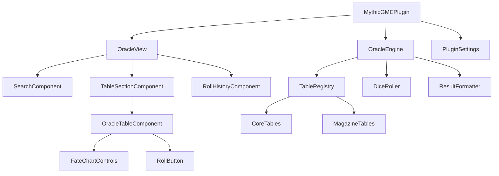

# Design Document

## Overview

The Mythic GME Plugin for Obsidian provides an integrated sidebar interface for accessing and rolling oracle tables from Mythic GME v2 and Mythic Magazine. The plugin architecture follows Obsidian's plugin patterns, utilizing ItemView for the sidebar panel, custom UI components for table interaction, and a data-driven approach for oracle table management.

The design emphasizes:

-   Clean separation between data (oracle tables), logic (rolling mechanics), and presentation (UI components)
-   Extensibility for adding new oracle tables
-   Persistent state management for user preferences
-   Seamless integration with Obsidian's editor API

## Architecture

### High-Level Component Structure



### Component Responsibilities

**MythicGMEPlugin** (Main Plugin Class)

-   Extends Obsidian's Plugin class
-   Initializes the OracleView and registers it with the workspace
-   Manages plugin lifecycle (load/unload)
-   Registers commands for opening the oracle panel
-   Handles settings persistence

**OracleView** (ItemView)

-   Extends Obsidian's ItemView for sidebar integration
-   Manages the overall UI layout and state
-   Coordinates between search, table sections, and roll history
-   Handles view lifecycle and cleanup

**OracleEngine**

-   Core business logic for oracle operations
-   Manages table registry and lookup
-   Executes dice rolls with appropriate logic
-   Formats results for display and insertion

**UI Components**

-   Modular, reusable components for different UI sections
-   Handle user interactions and delegate to OracleEngine
-   Manage local component state

## Components and Interfaces

### Core Data Models

```typescript
// Oracle table types
enum DiceType {
	D100 = "d100", // Percentile (1-100)
	D20 = "d20", // 1-20
	D10 = "d10", // 1-10
	D6 = "d6", // 1-6
	CUSTOM = "custom", // Custom range
}

interface OracleTableEntry {
	range: [number, number]; // Inclusive range [min, max]
	result: string;
}

enum OracleType {
	TOOL = "Tool",
	VARIATION = "Variation",
	STANDARD = "Standard",
	DESCRIPTOR = "Descriptor",
}

interface OracleTable {
	id: string;
	name: string;
	category: string;
	type: OracleType;
	diceType: DiceType;
	entries: OracleTableEntry[];
	description?: string;
}

// Fate Chart specific
enum FateChartOdds {
	IMPOSSIBLE = "Impossible",
	NEAR_IMPOSSIBLE = "Near Impossible",
	VERY_UNLIKELY = "Very Unlikely",
	UNLIKELY = "Unlikely",
	FIFTY_FIFTY = "50/50",
	LIKELY = "Likely",
	VERY_LIKELY = "Very Likely",
	NEAR_CERTAIN = "Near Certain",
	CERTAIN = "Certain",
}

interface FateChartParams {
	chaosFactor: number; // 1-9
	odds: FateChartOdds;
}

// Roll results
interface RollResult {
	tableName: string;
	tableId: string;
	result: string;
	diceRoll?: number;
	timestamp: number;
	params?: FateChartParams; // For Fate Chart rolls
}

interface CombinedRollResult {
	tableName: string;
	results: RollResult[];
	timestamp: number;
}

// Table organization
interface TableCategory {
	id: string;
	name: string;
	tables: OracleTable[];
	source: "core" | "magazine";
	collapsed: boolean;
}
```

### Plugin Settings

```typescript
interface MythicGMESettings {
	// UI state
	collapsedSections: Record<string, boolean>;

	// Fate Chart defaults
	lastChaosFactor: number;
	lastOdds: FateChartOdds;

	// Roll history
	maxHistorySize: number;
	rollHistory: RollResult[];

	// Feature toggles
	showMagazineTables: boolean;
	autoInsertToNote: boolean;

	// Filters
	activeTypeFilters: OracleType[];
}

const DEFAULT_SETTINGS: MythicGMESettings = {
	collapsedSections: {},
	lastChaosFactor: 5,
	lastOdds: FateChartOdds.FIFTY_FIFTY,
	maxHistorySize: 20,
	rollHistory: [],
	showMagazineTables: true,
	autoInsertToNote: false,
	activeTypeFilters: [], // Empty = show all types
};
```

### OracleEngine Interface

```typescript
class OracleEngine {
	private tableRegistry: Map<string, OracleTable>;
	private categories: TableCategory[];

	constructor(tables: OracleTable[]);

	// Table access
	getTable(id: string): OracleTable | undefined;
	getCategories(): TableCategory[];
	searchTables(query: string): OracleTable[];
	filterByType(types: OracleType[]): OracleTable[];

	// Rolling
	roll(tableId: string, params?: FateChartParams): RollResult;
	rollCombined(tableIds: string[]): CombinedRollResult;

	// Formatting
	formatResult(result: RollResult): string;
	formatCombinedResult(result: CombinedRollResult): string;
}
```

### View Interface

```typescript
class OracleView extends ItemView {
	private plugin: MythicGMEPlugin;
	private engine: OracleEngine;
	private searchQuery: string;

	getViewType(): string;
	getDisplayText(): string;
	getIcon(): string;

	async onOpen(): Promise<void>;
	onClose(): Promise<void>;

	// UI rendering
	private renderSearch(): void;
	private renderTypeFilters(): void;
	private renderCategories(): void;
	private renderRollHistory(): void;

	// Event handlers
	private handleRoll(tableId: string, params?: FateChartParams): void;
	private handleCombinedRoll(tableIds: string[]): void;
	private handleInsertToNote(result: string): void;
	private handleClearHistory(): void;
	private handleSearch(query: string): void;
	private handleTypeFilter(types: OracleType[]): void;
}
```

## Data Models

### Oracle Table Data Structure

Oracle tables will be stored as TypeScript constants in separate files organized by source:

```
src/
  tables/
    core/
      fateChart.ts
      eventMeaning.ts
      descriptors.ts
    magazine/
      [magazine-tables].ts
    index.ts  // Exports all tables
```

### Fate Chart Implementation

The Fate Chart is unique as it requires a 2D lookup based on Chaos Factor and Odds:

```typescript
interface FateChartCell {
	exceptionalNo: number;
	no: number;
	yes: number;
	exceptionalYes: number;
}

const FATE_CHART: Record<FateChartOdds, Record<number, FateChartCell>> = {
	// Chaos Factor 1-9 for each odds level
	// Each cell contains thresholds for d100 roll
};

function rollFateChart(params: FateChartParams): RollResult {
	const roll = Math.floor(Math.random() * 100) + 1;
	const cell = FATE_CHART[params.odds][params.chaosFactor];

	let result: string;
	if (roll <= cell.exceptionalNo) {
		result = "Exceptional No";
	} else if (roll <= cell.no) {
		result = "No";
	} else if (roll <= cell.yes) {
		result = "Yes";
	} else {
		result = "Exceptional Yes";
	}

	return {
		tableName: "Fate Chart",
		tableId: "fate-chart",
		result,
		diceRoll: roll,
		timestamp: Date.now(),
		params,
	};
}
```

### Event Meaning Combined Roll

```typescript
const EVENT_MEANING_ACTION_TABLE_ID = "event-meaning-action";
const EVENT_MEANING_DESCRIPTION_TABLE_ID = "event-meaning-description";

function rollEventMeaning(engine: OracleEngine): CombinedRollResult {
	const action = engine.roll(EVENT_MEANING_ACTION_TABLE_ID);
	const description = engine.roll(EVENT_MEANING_DESCRIPTION_TABLE_ID);

	return {
		tableName: "Event Meaning",
		results: [action, description],
		timestamp: Date.now(),
	};
}
```

## UI Design

### Sidebar Layout

```
┌─────────────────────────────────┐
│ Mythic GME Oracles         [×]  │
├─────────────────────────────────┤
│ [Search tables...]              │
│ Filter: [Tool][Variation][All]  │
├─────────────────────────────────┤
│ ▼ Core Mythic GME v2            │
│   • Fate Chart            [🎲]  │
│   • Event Meaning         [🎲]  │
│   • Action                [🎲]  │
│   • Description           [🎲]  │
│   • Descriptors           [🎲]  │
│                                 │
│ ▶ Mythic Magazine               │
│                                 │
├─────────────────────────────────┤
│ Recent Rolls            [Clear] │
│ ┌─────────────────────────────┐ │
│ │ Fate Chart: Yes       [📋]  │ │
│ │ Chaos: 5, Odds: 50/50       │ │
│ │ 2 minutes ago               │ │
│ └─────────────────────────────┘ │
│ ┌─────────────────────────────┐ │
│ │ Event Meaning:        [📋]  │ │
│ │ Oppose - Technology         │ │
│ │ 5 minutes ago               │ │
│ └─────────────────────────────┘ │
└─────────────────────────────────┘
```

### Fate Chart Expanded View

```
┌─────────────────────────────────┐
│ • Fate Chart                    │
│   ┌───────────────────────────┐ │
│   │ Chaos Factor: [5] (1-9)   │ │
│   │ Odds: [50/50 ▼]           │ │
│   │           [Roll Fate 🎲]  │ │
│   └───────────────────────────┘ │
└─────────────────────────────────┘
```

### Roll Result Display

Each roll result in history shows:

-   Table name and result text (prominent)
-   Copy to clipboard button
-   Insert to note button
-   Timestamp (relative)
-   Additional context (for Fate Chart: chaos/odds, for combined: sub-results)

## Error Handling

### Error Scenarios

1. **No Active Note for Insertion**

    - Display Obsidian Notice: "No active note open. Please open a note to insert results."
    - Disable insert button when no active view

2. **Invalid Table ID**

    - Log error to console
    - Display Notice: "Oracle table not found"
    - Gracefully skip in UI

3. **Clipboard API Failure**

    - Fallback to legacy clipboard methods
    - Display Notice if all methods fail

4. **Invalid Fate Chart Parameters**

    - Validate chaos factor (1-9) and odds selection
    - Display validation errors inline
    - Prevent roll until valid

5. **Settings Load/Save Failure**
    - Use default settings as fallback
    - Log error for debugging
    - Don't block plugin functionality

### Error Handling Strategy

```typescript
class ErrorHandler {
	static handleRollError(error: Error, tableName: string): void {
		console.error(`Roll error for ${tableName}:`, error);
		new Notice(`Failed to roll ${tableName}. Please try again.`);
	}

	static handleInsertError(error: Error): void {
		console.error("Insert error:", error);
		new Notice("Failed to insert result. Please check if a note is open.");
	}

	static handleClipboardError(error: Error): void {
		console.error("Clipboard error:", error);
		new Notice("Failed to copy to clipboard.");
	}
}
```

## Testing Strategy

### Unit Testing

Focus on core logic that doesn't depend on Obsidian API:

1. **OracleEngine Tests**

    - Table lookup and search
    - Dice rolling logic (with seeded random for determinism)
    - Result formatting
    - Combined rolls

2. **Fate Chart Logic Tests**

    - Correct result for given roll value and parameters
    - Boundary conditions (roll = 1, roll = 100)
    - All odds/chaos combinations

3. **Data Validation Tests**
    - Table entry ranges don't overlap
    - All ranges cover expected dice range
    - No gaps in coverage

### Integration Testing

Test Obsidian API integration:

1. **View Lifecycle**

    - View opens and closes correctly
    - State persists across sessions
    - Commands registered properly

2. **Editor Integration**

    - Insert at cursor position
    - Handle no active editor
    - Preserve cursor position

3. **Settings Persistence**
    - Settings save and load
    - Defaults applied correctly
    - Migration from old versions

### Manual Testing Checklist

-   [ ] Sidebar opens via command palette
-   [ ] All tables render correctly
-   [ ] Sections collapse/expand and persist
-   [ ] Search filters tables correctly
-   [ ] Roll buttons generate results
-   [ ] Results copy to clipboard
-   [ ] Results insert to active note
-   [ ] Fate Chart controls work correctly
-   [ ] Event Meaning combined roll works
-   [ ] Roll history displays and clears
-   [ ] Plugin survives Obsidian restart

## Development Environment Setup

### Dev Vault Structure

Create a test vault for hot-reload development:

```
project-root/
  dev-vault/
    .obsidian/
      plugins/
        mythic-gme-plugin/  (symlink to build output)
    Test Note.md
```

### Setup Steps

1. Create dev vault directory
2. Initialize as Obsidian vault (open once in Obsidian)
3. Create symlink from `dev-vault/.obsidian/plugins/mythic-gme-plugin` to project root
4. Copy manifest.json and styles.css to symlinked directory
5. Run `npm run dev` for watch mode
6. Enable plugin in Obsidian dev vault
7. Use Ctrl/Cmd + R to reload Obsidian after changes

### Build Scripts

```json
{
	"scripts": {
		"dev": "node esbuild.config.mjs",
		"build": "tsc -noEmit -skipLibCheck && node esbuild.config.mjs production",
		"setup-dev": "node scripts/setup-dev-vault.js"
	}
}
```

The `setup-dev` script will automate:

-   Creating dev-vault directory structure
-   Setting up symlinks
-   Copying necessary files
-   Providing instructions for enabling the plugin

## Performance Considerations

### Optimization Strategies

1. **Lazy Loading Tables**

    - Load table data only when category is expanded
    - Reduces initial load time for large table collections

2. **Search Debouncing**

    - Debounce search input (300ms) to avoid excessive filtering
    - Use simple string matching (case-insensitive includes)

3. **Virtual Scrolling** (Future Enhancement)

    - If table list becomes very large
    - Render only visible items

4. **Efficient State Updates**

    - Batch DOM updates when possible
    - Use DocumentFragment for building complex UI

5. **Settings Throttling**
    - Throttle settings saves to avoid excessive disk writes
    - Save on plugin unload to ensure persistence

### Memory Management

-   Limit roll history size (configurable, default 20)
-   Clean up event listeners on view close
-   Remove DOM elements properly to avoid leaks

## Extensibility

### Adding New Tables

New oracle tables can be added by:

1. Creating a new table definition file in `src/tables/`
2. Following the OracleTable interface
3. Exporting from `src/tables/index.ts`
4. Tables automatically appear in UI based on category

Example:

```typescript
// src/tables/magazine/customTable.ts
export const customTable: OracleTable = {
	id: "custom-table",
	name: "Custom Oracle",
	category: "Custom Category",
	diceType: DiceType.D100,
	entries: [
		{ range: [1, 10], result: "Result 1" },
		// ...
	],
};
```

### Plugin Settings UI

Future enhancement: Add settings tab for:

-   Toggling table collections
-   Customizing result format templates
-   Configuring history size
-   Importing custom tables (JSON)

## Design Decisions and Rationale

### Why ItemView for Sidebar?

ItemView is Obsidian's recommended approach for sidebar panels. It provides:

-   Automatic integration with workspace layout
-   Persistence across sessions
-   Consistent UX with other Obsidian panels

### Why Separate OracleEngine?

Separating business logic from UI:

-   Enables unit testing without Obsidian API
-   Makes logic reusable
-   Simplifies UI components
-   Easier to maintain and extend

### Why Static Table Data?

Oracle tables are static content that doesn't change:

-   No need for external files or database
-   Type-safe with TypeScript
-   Bundled with plugin (no loading errors)
-   Easy to version control

Future: Could support loading custom tables from vault files

### Why Copy to Clipboard by Default?

Copying results automatically:

-   Supports quick paste workflow
-   Non-intrusive (doesn't modify notes automatically)
-   User maintains control over where results go
-   Clipboard is universal (works everywhere)

### Why Roll History?

Roll history provides:

-   Context for recent decisions
-   Ability to reference previous rolls
-   Undo-like functionality (can re-insert old results)
-   Session continuity

## Future Enhancements

Potential features for future versions:

1. **Custom Table Import**

    - Load tables from JSON files in vault
    - User-defined oracle tables

2. **Roll Macros**

    - Save common roll combinations
    - Quick access to frequent workflows

3. **Dice Notation Support**

    - Support complex dice expressions (2d6+3)
    - For custom tables

4. **Result Templates**

    - Customizable formatting for inserted results
    - Support for different note structures

5. **Mobile Optimization**

    - Touch-friendly UI
    - Responsive layout for smaller screens

6. **Statistics Tracking**

    - Track roll frequency
    - Analyze patterns over time

7. **Integration with Dataview**

    - Query roll results from notes
    - Generate reports on oracle usage

8. **Oracle Type Filtering**
    - Filter tables by type (Tool, Variation, Standard, Descriptor)
    - Toggle filters to show/hide specific oracle types
    - Persist filter preferences across sessions
